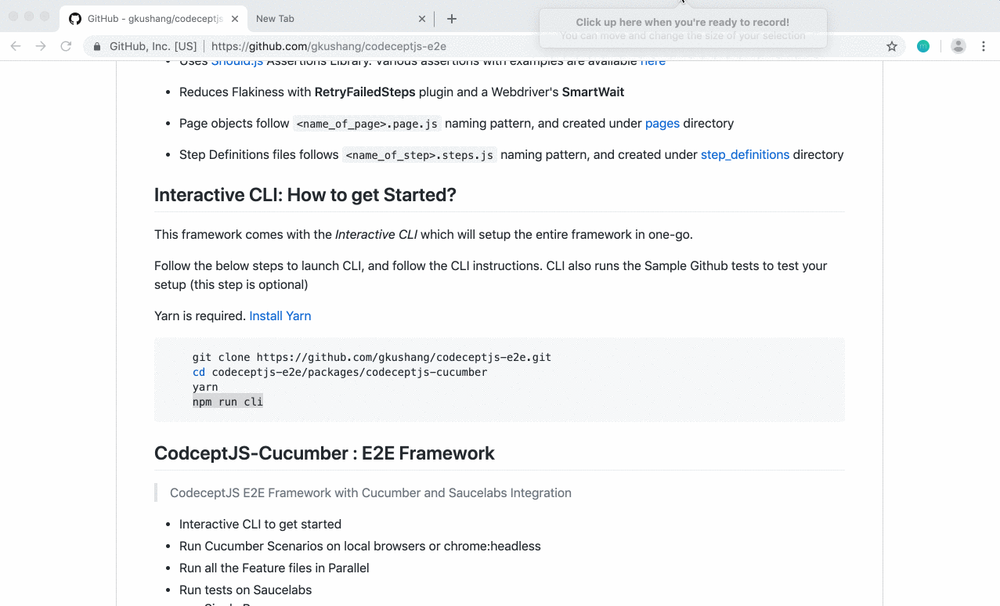

# CodeceptJS BDD

***[CodeceptJS](https://codecept.io/) BDD Framework with Cucumber and Saucelabs cloud***

[](https://travis-ci.org/gkushang/codeceptjs-bdd) [](https://codeclimate.com/github/gkushang/codeceptjs-bdd/maintainability) [](https://lerna.js.org/) [](LICENSE)
[](https://postimg.cc/wyNP0N3w)

> This framework contains Gherkin BDD Tests with CodeceptJS & uses Should.JS assertion library. Intgrated with Saucelabs to run on Multibrowsers in Parallel

## 📖Guide

Framework Documentation: https://github.com/gkushang/codeceptjs-bdd

## 🧐 What's inside?

* **Why BDD?** Read my Medium post [here](https://medium.com/hackernoon/bdd-in-3-minutes-c3f8fc022237)

* Run All feature files in **Parallel**

* Run All feature files on **Multi-Browsers - run them all in Parallel**

* Scenarios are written in **Cucumber Gherkin BDD Syntax**, a.k.a `.feature` files. [Prefer writing Declartive Test Scenarios](https://wiki.saucelabs.com/display/DOCS/Best+Practice%3A+Imperative+v.+Declarative+Testing+Scenarios)

* Run on **SauceLabs**. Single browser or Multi-Browsers in Parallel

* Uses [Should.js](https://shouldjs.github.io/) Assertions Library. Various assertions with examples are available [here](https://github.com/gkushang/codeceptjs-bdd/blob/master/packages/codeceptjs-cucumber/acceptance/step_definitions/search/github.steps.js)

* Reduces Flakiness with **RetryFailedSteps** plugin and a Webdriver's **SmartWait**

* Page objects follow `<name_of_page>.page.js` naming pattern, and created under [pages](https://github.com/gkushang/codeceptjs-bdd/tree/master/packages/codeceptjs-cucumber/acceptance/pages/) directory

* Step Definitions files follows `<name_of_step>.steps.js` naming pattern, and created under [step_definitions](https://github.com/gkushang/codeceptjs-bdd/tree/master/packages/codeceptjs-cucumber/acceptance/step_definitions) directory

* **Soft Assertions:** Collect more errors in a single run rather than failing test at first failure!

👉 HTML Docs are coming soon! Stay tuned for more updates!

## 😇 Benefits of this Framework

[](https://postimg.cc/WFgHkhqk)
[](https://postimg.cc/mhGb69wK)
[](https://postimg.cc/7C2kKPTx)

## 🚀 Getting Started : Interactive CLI

This framework comes with the *Interactive CLI* which will setup the entire framework in one-go.

Follow the below steps to launch CLI, and follow the CLI instructions. CLI also runs the Sample Github tests to test your setup (this step is optional)

Yarn is required. [Install Yarn](https://yarnpkg.com/en/docs/install#mac-stable)

```bash

    git clone https://github.com/gkushang/codeceptjs-bdd.git
    cd codeceptjs-bdd/packages/codeceptjs-cucumber
    yarn
    npm run cli
```




## 🥒 CodceptJS-Cucumber : BDD Framework

> CodeceptJS BDD Framework with Cucumber and Saucelabs Integration

* Interactive CLI to get started
* Run Cucumber Scenarios on local browsers or chrome:headless
* Run all the Feature files in Parallel
* Run tests on Sauce Labs
  * Single Browser
  * Multi Browsers. Runs all the Feature files in Parallel on Multi Browsers
* HTML report
* Soft Assertions: Collect more errors in a single run rather than failing test at first failure!
    1.  deepAssert(actual, expected, msg, ignoreKeys)
    2.  softAssert(actual, expected, msg, ignoreKeys)
    3.  deepContains(actual, expected, msg, ignoreKeys)
    4.  softContains(actual, expected, msg, ignoreKeys)
    5.  deepAssertKey(actual, expected, key, msg, ignoreKeys)
    6.  softAssertKey(actual, expected, key, msg, ignoreKeys)
    7.  deepContainstKey(actual, expected, key, msg, ignoreKeys)
    8.  softContainsKey(actual, expected, key, msg, ignoreKeys)
    9.  deeptTrue(value, msg)
    10. softTrue(value, msg)
    11. deepAssertKeyAbsence(actual, key, msg)
    12. softAssertKeyAbsence(actual, key, msg)
    13. softAssertAll()
    
    Example Usage of Soft Assertion is available [here](https://github.com/gkushang/codeceptjs-bdd/blob/develop/packages/codeceptjs-cucumber/acceptance/steps/search/github.steps.js#L18-L44)

## ☁️ CodeceptJS-Sauce Labs : Single or Multi Browsers in Parallel

> CodeceptJs Integration with Saucelabs. Ease of Configuration!

* Easy to run tests on Saucelabs with command 

```bash
  yarn acceptance --profile sauce:chrome
```

* Easy to run tests on Multibrowsers / Cross-Browsers. All tests in Parallel with command 

```bash
  yarn acceptance:multibrowsers --profile sauce:chrome,ie,safari
```

To get started, follow the instructions on [codeceptjs-saucelabs](https://github.com/gkushang/codeceptjs-bdd/tree/master/packages/codeceptjs-saucelabs)


## 🔎 CodeceptJS-Shared : Shared Master Configurations and Helpers

> Shared Master Configurations & Helpers

To get started, follow the instructions on [codeceptjs-shared](https://github.com/gkushang/codeceptjs-bdd/tree/master/packages/codeceptjs-shared)


## 🐬 Docker & Jenkinsfile

> Codecpetjs-bdd packed into the container with Node and Java. 

Codecpetjs-bdd Docker makes it very simple to build your CI Job. 

To run your Codecptjs-bdd tests on Saucelabs thru Jenkins, add below stage to your Jenkinsfile:

```bash

	stage('CodeceptJS Acceptance') {
            sh "docker run --env SAUCE_KEY --env SAUCE_USERNAME -v ${env.WORKSPACE}/:/acceptance --rm gkushang/codeceptjs-bdd --debug --profile sauce:${browser}"
        }

```

* If you tests uses any environment variables, pass to the Docker image thru `--env` param as shown above
* Select browser on Sauce Labs thru `${browser}` environment variable
* Mount your workspace to the Docker container with `-v` param as shown above.
