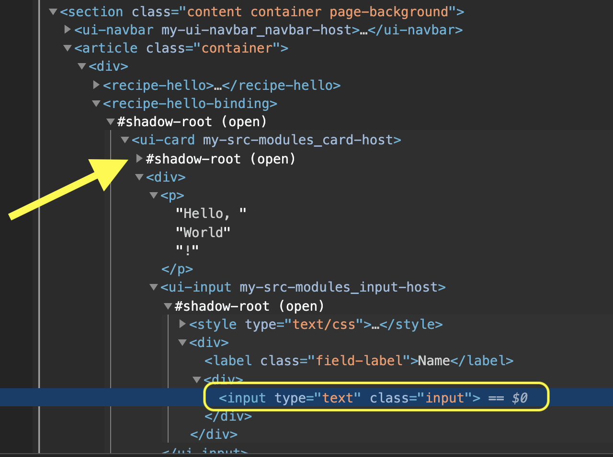

⭐️ Complete Example of WebComponents (shadow elements) E2E Tests with WebDriver & Playwright is available on github: [webcomponents-playwright-webdriver-example](https://github.com/salesforce/codeceptjs-bdd/tree/develop/examples/webcomponents-playwright-webdriver-example)

## ☁︎ Automate Salesforce Lighting Web Components

💯 **ADVANTAGE:** The framework provides the Shadow Locators equivalent to [Document.querySelector](https://developer.mozilla.org/en-US/docs/Web/API/Document/querySelector) for Webdriver.

🚀 Playwright has a native support to locate the Shadow Elements explicitly but WebDriver does not yet. **However, this framework adds the Explicit Support for WebDriver too.**

## Example

The complete example of E2E Tests for WebComponents (shadow-roots) is available on Github,

⏩ https://github.com/salesforce/codeceptjs-bdd/tree/develop/examples/webcomponents-playwright-webdriver-example)

The simpler locator will work with both WebDriver & Playwright

```javascript
I.fillField('recipe-hello-binding input', 'hello');
```



### 💁‍♂️ About LWC

[Lightning Web Components](https://developer.salesforce.com/docs/component-library/documentation/en/lwc) is open source by Salesforce, empowering you to explore the source code, customize the behavior for your needs, and build enterprise-ready web components on any platform, not just Salesforce.

---
